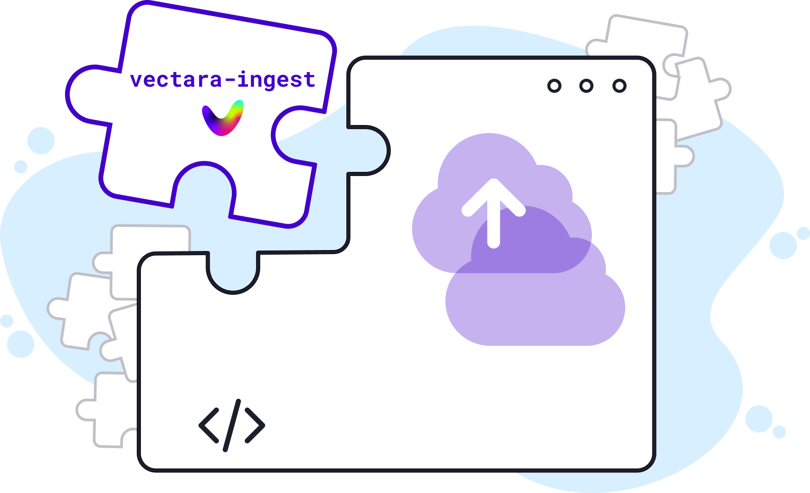

<h1 align="center">Welcome to vectara-ingest</h1>
<p align="center">
  
</p>

<p>
  
  <a href="https://github.com/vectara/vectara-ingest#readme" target="_blank">
    
  </a>
  <a href="https://github.com/vectara/vectara-ingest/graphs/commit-activity" target="_blank">
    
  </a>
  <a href="https://twitter.com/vectara" target="_blank">
    
  </a>
</p>

## About

Crawl datasets and ingest them into Vectara using pre-built crawlers or by building your own. With Vectara’s [APIs](https://docs.vectara.com/docs/) you can create conversational experiences with your data, such as chatbots, semantic search, and workplace search.

`vectara-ingest` is an open source Python project that demonstrates how to crawl datasets and ingest them into Vectara. It provides a step-by-step guide on building your own crawler, as well as pre-built crawlers for ingesting data from sources such as: websites, RSS feeds, Jira, Notion, Docusaurus and more.

## Quickstart

Let’s create a basic crawler to scrape content from [Paul Graham's website](http://www.paulgraham.com/index.html), and ingest it into Vectara. This guide assumes you’ve already [signed up for a free Vectara account](https://console.vectara.com/signup), created a corpus to contain your data (default settings are fine), and created an [API key](https://docs.vectara.com/docs/api-keys) with write-access to this corpus.

### 1. Install dependencies

Install [python >= 3.8](https://www.python.org/downloads/) if it's not already installed.

Install [pyyaml](https://pypi.org/project/PyYAML/): `pip3 install pyyaml`.

Install [Docker](https://docs.docker.com/engine/install/).

For Windows, 
- Start a Windows Powershell terminal
- Update WSL: `wsl --update`
- Ensure WSL has the right version of Linux available: `wsl --install ubuntu-20.04` 

Clone this repository:

```sh
git clone https://github.com/vectara/vectara-ingest.git
```

### 2.a Configure the crawler for vectara

Duplicate the `secrets.example.toml` file and rename the copy to `secrets.toml`.

Edit the `secrets.toml` file and change the **api_key** value to your Vectara API Key.

Since the Paul Graham website does not have a standard sitemap, you're going to crawl its content using the [RSS feed](http://www.paulgraham.com/rss.html) built by Aaron Swartz. You can do this by looking inside the `config/` directory, duplicating the `news-bbc.yaml` config file, and renaming it to `pg-rss.yaml`.

Edit the `pg-rss.yaml` file and make the following changes:

- Change **vectara.corpus_id** value to the ID of the corpus into which you want to ingest the content of the website.
- Change **vectara.account_id** value to the ID of your account. You can click on your username in the top-right corner to copy it to your clipboard.
- Change **rss_crawler.source** to `pg`.
- Change **rss_crawler.rss_pages** to `["http://www.aaronsw.com/2002/feeds/pgessays.rss"]`.
- Change **rss_crawler.days_past** to 365.

### 2.b Configure the crawler for arguflow

Edit the `secrets.toml` file and make the following changes
- Change `USE_ARGUFLOW` to true
- Change `api_key` to your generated api_key
- Change `endpoint` to the api url of your arguflow instance

### 3. Run the crawler

Make sure the Docker app is running.

Then execute the run script from the root directory using your config file to tell it what to crawl and where to ingest the data, assigning the “default” profile from your secrets file:

Start the crawler job:
```sh
bash run.sh config/pg-rss.yaml default
```
For Microsoft Windows, make sure you run this command from within the WSL 2 environment (after running `wsl` to enter the Linux environment).

The crawler executes inside of a [Docker container](https://www.docker.com/resources/what-container/) to protect your system’s resources and make it easier to move your crawlers to the cloud. This is a good time to grab a coffee or snack – the container needs to install a lot of dependencies, which will take some time.

When the container is set up, the process will exit and you’ll be able to track your crawler’s progress:

```
docker logs -f vingest
```

### 4. Done!

Paul Graham is a prolific writer, so ingesting all of his work might take a few minutes. But even while your crawler ingesting data into your Vectara corpus, you can build applications that query it! Try out some sample queries with the Vectara Console ("search" tab) -- one of my favorites is "What is a maker schedule?"

## Code organization

The codebase includes the following components.

### `core/` directory

Fundamental utilities depended upon by the crawlers:

- **`ingest.py`:** The main entry point for a crawl job.
- **`indexer.py`:** Defines the `Indexer` class which implements helpful methods to index data into Vectara such as `index_url`, `index_file()` and `index_document()`.
- **`crawler.py`:** Defines the `Crawler` class which implements a base class for crawling, where each specific crawler should implement the `crawl()` method specific to its type.
- **`pdf_convert.py`:** Helper class to convert URLs into local PDF documents.
- **`utils.py`:** Some utility functions used by the other code.

### `crawlers/` directory

Includes implementations of the various specific crawlers.

### `config/` directory

Includes example YAML configuration files for various crawling jobs.

### `run.sh`

The main shell script to execute when you want to launch a crawl job (see below for more details).

### `Dockerfile`

Defines the Docker container image.

## Crawling

### Configuration

To crawl and index a source you run a crawl "job", which is controlled by several paramters that you can define in a YAML configuration file. You can see example configuration files in the [config/](config) directory.

Each configuration YAML file includes a set of standard variables, for example:

```yaml
vectara:
  # the corpus ID for indexing
  corpus_id: 4
  # the Vectara customer ID
  customer_id: 1234567
  # flag: should vectara-ingest reindex if document already exists (optional)
  reindex: false
  # timeout (optional); sets the URL crawling timeout in seconds
  timeout: 45

USE_ARGUFLOW: false

arguflow:
  # Your arguflow endpoint
  endpoint: https://

crawling:
  # type of crawler; valid options are website, docusaurus, notion, jira, rss, mediawiki, discourse, github and others (this continues to evolve as new crawler types are added)
  crawler_type: XXX
```

Following that, where needed, the same YAML configuration file will include crawler-specific section with crawler-specific parameters (see [about crawlers](crawlers/CRAWLERS.md)):

```yaml
XXX_crawler:
  # specific parameters for the crawler XXX
```

### Secrets management

We use a `secrets.toml` file to hold secret keys and parameters. You need to create this file in the root directory before running a crawl job. This file can hold multiple "profiles", and specific specific secrets for each of these profiles. For example:

```
[profile1]
api_key="<VECTAR-API-KEY-1>

[profile2]
api_key="<VECTARA-API-KEY-2>"

[profile3]
api_key="<VECTARA-API-KEY-3>"
MOTION_API_KEY="<YOUR-NOTION-API-KEY>

[arguflow-default]
USE_ARGUFLOW=true
api_key = "...arguflow-api-key..."
endpoint = "https://your-arguflow-endpoint.com/api"
```

This allows easy secrets management when you have multiple crawl jobs that may not share the same secrets. For example when you have a different Vectara API key for indexing differnet corpora.

Many of the crawlers have their own secrets, for example Notion, Discourse, Jira, or GitHub. These are also kept in the secrets file in the appropriate section and need to be all upper case (e.g. `NOTION_API_KEY` or `JIRA_PASSWORD`).

### Indexer Class

The `Indexer` class provides useful functionality to index documents into Vectara.

#### Methods

##### `index_url()`

This is probably the most useful method. It takes a URL as input and extracts the content from that URL (using the `playwright` and `Goose3` libraries), then sends that content to Vectara using the standard indexing API. If the URL points to a PDF document, special care is taken to ensure proper processing.
Please note that we use `Goose3` to extract the main (most important) content of the article, ignoring links, ads and other not-important content. If your crawled content has different requirements you can change the code to use a different extraction mechanism (html to text).

##### `index_file()`

Use this when you have a file that you want to index using Vectara's file_uplaod [API](https://docs.vectara.com/docs/indexing-apis/file-upload), so that it takes care of format identification, segmentation of text and indexing.

##### `index_document()` and `index_segments()`

Use these when you build the `document` JSON structure directly and want to index this document in the Vectara corpus.

#### Parameters

Specifically, the `reindex` parameter determines whether an existing document should be reindexed or not. If reindexing is required, the code automatically takes care of that by calling `delete_doc()` to first remove the document from the corpus and then sends it to the corpus index.

## Deployment

### Docker

The project is designed to be used within a Docker container, so that a crawl job can be run anywhere - on a local machine or on any cloud machine. See the [Dockerfile](https://github.com/vectara/vectara-ingest/blob/main/Dockerfile) for more information on the Docker file structure and build.

### Local deployment

To run `vectara-ingest` locally, perform the following steps:

1. Make sure you have [Docker installed](https://docs.docker.com/engine/install/) on your machine.
2. Clone this repo locally with `git clone https://github.com/vectara/vectara-ingest.git`.
3. Enter the directory with `cd vectara-ingest`.
4. Choose the configuration file for your project and run `bash run.sh config/<config-file>.yaml <profile>`. This command creates the Docker container locally, configures it with the parameters specified in your configuration file (with secrets taken from the appropriate `<profile>` in `secrets.toml`), and starts up the Docker container.

### Cloud deployment

`vectara-ingest` can be easily deployed on any cloud platform such as AWS, Azure or GCP.

1. Create your configuration file for the project under the `config/` directory.
2. Run `docker build . --tag=vectara-ingest:latest` to generate the Docker container.
3. Push the docker to the cloud specific docker container registry:
   - [AWS instructions](https://docs.aws.amazon.com/AmazonECS/latest/developerguide/docker-basics.html).
   - [Azure instructions](https://learn.microsoft.com/en-us/azure/container-apps/get-started-existing-container-image-portal?pivots=container-apps-private-registry).
   - [GCP instructions](https://cloud.google.com/run/docs/quickstarts/build-and-deploy).
4. Launch the container on a VM instance based on the Docker image now hosted in your cloud environment.

### docker-hub

The `vectara-ingest` container is available for easy deployment via [docker-hub](https://hub.docker.com/repository/docker/vectara/vectara-ingest/general).

## Author

👤 **Vectara**

- Website: [vectara.com](https://vectara.com)
- Twitter: [@vectara](https://twitter.com/vectara)
- GitHub: [@vectara](https://github.com/vectara)
- LinkedIn: [@vectara](https://www.linkedin.com/company/vectara/)
- Discord: [@vectara](https://discord.gg/GFb8gMz6UH)

## 🤝 Contributing

Contributions, issues and feature requests are welcome and appreciated!<br />
Feel free to check [issues page](https://github.com/vectara/vectara-ingest/issues). You can also take a look at the [contributing guide](https://github.com/vectara/vectara-ingest/blob/master/CONTRIBUTING.md).

## Show your support

Give a ⭐️ if this project helped you!

## 📝 License

Copyright © 2023 [Vectara](https://github.com/vectara).<br />
This project is [Apache 2.0](https://github.com/vectara/vectara-ingest/blob/master/LICENSE) licensed.
