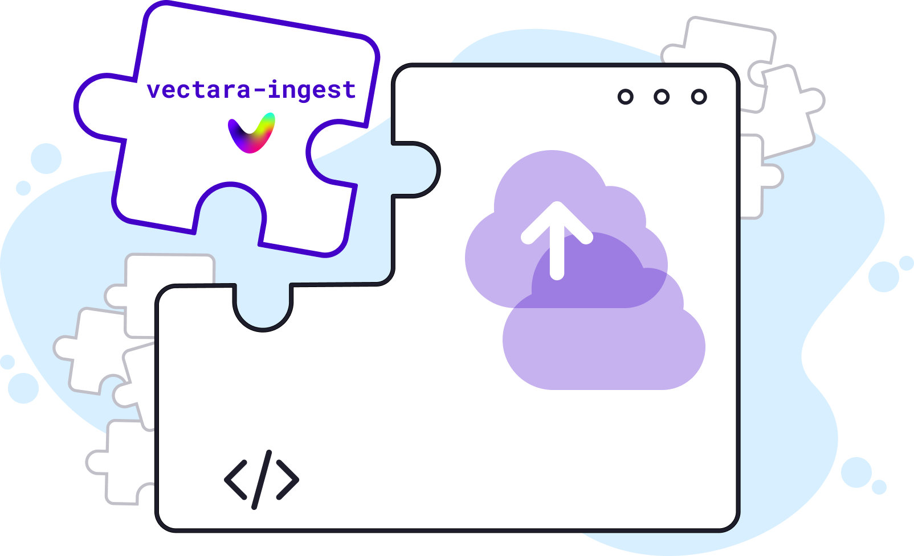

<h1 align="center">Welcome to vectara-ingest</h1>
<p align="center">
  
</p>

<h2>Build Ingest pipeline for Vectara<h2>

[](https://opensource.org/licenses/Apache-2.0)
[](https://github.com/vectara/vectara-ingest/graphs/commit-activity)

[](https://twitter.com/vectara)
[](https://discord.com/invite/GFb8gMz6UH)

[](https://vscode.dev/redirect?url=vscode://ms-vscode-remote.remote-containers/cloneInVolume?url=https://github.com/vectara/vectara-ingest)

# About `vectara-ingest`
Vectara is the trusted GenAI platform providing simple [APIs](https://docs.vectara.com/docs/) to create conversational experiences&mdash;such as chatbots, semantic search, and question answering&mdash;from your data.

`vectara-ingest` is an open source Python project that demonstrates how to crawl datasets and ingest them into Vectara. It provides a step-by-step guide on building your own crawler and some pre-built crawlers for ingesting data from sources such as:

* Websites
* RSS feeds
* Jira tickets
* Notion notes
* Wolken KB articles
* Fluid Topics tenants
* Docusaurus documentation sites
* Slack
* And many others...

For more information about this repository, see [Code Organization](#code-organization) and [Crawling](#crawling).

# Getting Started Guide

vectara-ingest can be used in multiple ways:

1. **Docker container** - The instructions below show how to run vectara-ingest in a Docker container
2. **Command-line interface (CLI)** - vectara-ingest can be installed as a CLI tool using conda
3. **Python package** - vectara-ingest can be imported and used in your Python applications

For details on using vectara-ingest as a conda package or importing it in your code, please refer to the [conda/README.md](conda/README.md) file.

This guide explains how to create a basic crawler to scrape content from [Paul Graham's website](http://www.paulgraham.com/index.html), and ingest it into Vectara.

## Prerequisites
* A [Vectara account](https://console.vectara.com/signup)
* A Vectara corpus with an [API key](https://docs.vectara.com/docs/api-keys) that provides indexing permissions
* [Python 3.8 (or higher)](https://www.python.org/downloads/)
* [pyyaml](https://pypi.org/project/PyYAML/) - install with: `pip install pyyaml`
* [Docker](https://docs.docker.com/engine/install/) installed

## Step 1: Clone the `vectara-ingest` repository
This section explains how to clone the `vectara-ingest` repository to your machine.

### On Linux or MacOS
Open a terminal session and clone the repository to a directory on your machine:

```bash
git clone https://github.com/vectara/vectara-ingest.git
```

### On Windows
1. Open a Windows PowerShell terminal.
  
2. Update your Windows Subsystem for Linux (WSL):

   ```bash
   wsl --update
   ```

3. Ensure that WSL has the correct version of Linux:

   ```bash
   wsl --install ubuntu-20.04
   ```
   
4. Open your **Linux terminal** and clone the repository to a directory on your machine:

   ```bash
   git clone https://github.com/vectara/vectara-ingest.git
   ```

Note: make sure you execute step #4 above only within your Linux environment and not in the windows environment. 
You may need to choose a username for your Ubuntu environment as part of the setup process.

## Step 2: Configure the crawler
For our example we would index the content of https://www.paulgraham.com website to Vectara. Since this website does not provide a sitemap, but does provide an [RSS feed](http://www.paulgraham.com/rss.html), we will use the vectara-ingest `RSS crawler` instead.

1. Navigate to the directory that you have cloned.

2. Copy the `secrets.example.toml` to `secrets.toml`. 

3. In the `secrets.toml` file, change `api_key` to the Vectara API Key.

   To retrieve your API key from the Vectara console, click **Access Control** in your corpus view or use the **Authorization** Tab.
   You can use your Vectara personal API key, or a query+write API key.

4. In the `config/` directory, copy the `news-bbc.yaml` config file to `pg-rss.yaml`.

5. Edit the `pg-rss.yaml` file and make the following changes:

   1. Change the `vectara.corpus_key` value to the corpus_key for the corpus into which you want to ingest the content of the website.

      To retrieve your corpus key from the Vectara console, click your corpus name dropdown and you will see the key on the top of the screen.

   2. Change `rss_crawler.source` to `pg`.
      
   3. Change `rss_crawler.rss_pages` to `["http://www.aaronsw.com/2002/feeds/pgessays.rss"]` so it points to the Paul Graham RSS feed.
      
   4. Change `rss_crawler.days_past` to `365`.

6. If Vectara is installed in your datacenter, and you are using an internal certificate authority:
   1. Write the entire certificate chain to `ca.pem` in the main `vectara-ingest` folder.
   2. Update your crawler config to include the following.
      ```yaml
      vectara:
         ssl_verify: /home/vectara/env/ca.pem
      ```

## Step 3: Run the crawler

1. Ensure that Docker is running on your local machine.

2. Run the script from the directory that you cloned and specify your `.yaml` configuration file and your `default` profile from the `secrets.toml` file.

   ```bash
   bash run.sh config/pg-rss.yaml default
   ```
   
   **Note:**
   * On Linux, ensure that the `run.sh` file is executable by running the following command:
  
     ```bash
     chmod +x run.sh
     ```

   * On Windows, ensure that you run this command from within the WSL 2 environment.

   **Note:** To protect your system's resources and make it easier to move your crawlers to the cloud, the crawler executes inside a Docker container. This is a lengthy process because in involves numerous dependencies

1. When the container is set up, you can track your crawler's progress:

   ```bash
   docker logs -f vingest
   ```

## Step 4: Try queries on your corpus

While your crawler is ingesting data into your Vectara corpus, you can try  queries against your corpus on the Vectara Console, click **Data > Your Corpus Name** and the under the **Query** tab type in a query such as "What is a maker schedule?"

## Code organization
The codebase includes the following components.

### main folder
- **`run.sh`:** The main shell script to execute when you want to launch a crawl job (see below for more details).
- **`ingest.py`:** The main entry point for a crawl job.
- **`Dockerfile`:** The Docker image definition file
- Various documentation files like **`README.MD`**, **`CONTRIBUTING.MD`**, or **`SECURITY.MD`**

### `core/` directory
Fundamental utilities depended upon by the crawlers:

- **`indexer.py`:** Defines the `Indexer` class which implements helpful methods to index data into Vectara such as `index_url`, `index_file()` and `index_document()`.
- **`crawler.py`:** Defines the `Crawler` class which implements a base class for crawling, where each specific crawler should implement the `crawl()` method specific to its type.
- **`pdf_convert.py`:** Helper class to convert URLs into local PDF documents.
- **`extract.py`:** Utilities for text extraction from HTML
- **`utils.py`:** Some utility functions used by the other code.

### `crawlers/` directory
Includes implementations of the various specific crawlers. Crawler files are always in the form of `xxx_crawler.py` where `xxx` is the type of crawler.

### `config/` directory
Includes example YAML configuration files for various crawling jobs.

### `img/` directory
Includes some images (png files) used in the documentation

## Crawling

### Configuration

To crawl and index a source you run a crawl "job", which is controlled by several paramters that you can define in a YAML configuration file. You can see example configuration files in the [config/](config) directory.

Each configuration YAML file includes a set of standard variables, for example:

```yaml
vectara:
  # endpoint for Vectara platform
  endpoint: api.vectara.io

  # authentication URL for OAuth (when using create_corpus)
  auth_url: auth.vectara.io

  # Define SSL verification for Vectara Platform
  # If `False`, SSL verification is disabled (not recommended for production). 
  # If a string, it is treated as the path to a custom CA certificate file. 
  # If `True` or not provided, default SSL verification is used.
  ssl_verify: True

  # the corpus key for indexing
  corpus_key: my-corpus
  
  # Chunking strategy
  chunking_strategy: sentence   # sentence or fixed
  chunk_size: 512               # only applies for "fixed" strategy

  # flag: should vectara-ingest reindex if document already exists (optional)
  reindex: false

  # flag: should vectara-ingest create the corpus (optional). defaults to false. 
  # When using this option, make sure your secrets.toml includes the personal API key.
  create_corpus: false
  
  # flag: store a copy of all crawled data that is indexed into a local folder
  # If enabled, data will be stored in this folder "~/tmp/mount/indexed_docs_XXX" in your local machine,
  # where XXX is a unique ID.
  store_docs: false
  
  # Directory path where vectara-ingest will store all output files, including reports, temporary files, and other artifacts. When running locally, this path is relative to the current working directory. When running in Docker, files are inside the container at `/home/vectara/{output_dir}/`. Default value is `vectara_ingest_output`.
  output_dir: vectara_ingest_output

  # timeout: sets the URL crawling timeout in seconds (optional; defaults to 90)
  # this applies to crawling web pages.
  timeout: 90

  # post_load_timeout: sets additional timeout past full page load to wait for animations and AJAX
  post_load_timeout: 5

  # flag: if true, will print extra debug messages when active
  verbose: false

  # flag: remove code or not from HTML (optional)
  remove_code: true
  
  # flag: should text extraction from web pages use special processing to remove boilerplate (optional)
  # this can be helpful when processing news pages or others which have a lot of advertising content
  remove_boilerplate: false

  # Whether masking of PII is attempted on all text fields (title, text, metadata values)
  # Notes: 
  # 1. This masking is never done on files uploaded to Vectara directly (via e.g. indexer.index_file())
  # 2. Masking is done using Microsoft Presidio PII analyzer and anonymizer, and is limited to English only
  mask_pii: false

  # Which whisper model to use for audio files (relevant for YT, S3 and folder crawlers)
  # Valid values: tiny, base, small, medium or large. Defaults to base.
  whisper_model: the model name for whisper

  # user agent to use when crawling web pages; defaults to standard agent.
  # If your website prevents crawling, you can allow a specific user agent and specify it here.
  user_agent: "vectara-crawler"

doc_processing:
  # see the full README in the repository for all document-processing options
  model: openai

crawling:
  # type of crawler; valid options are website, docusaurus, notion, jira, rss, mediawiki, discourse, github, fluidtopics and others
  crawler_type: XXX

metadata:
   project: foo
```

Following that, where needed, the same YAML configuration file will a include crawler-specific section with crawler-specific parameters (see [about crawlers](crawlers/CRAWLERS.md)):

```yaml
XXX_crawler:
  # specific parameters for the crawler XXX
```

For the Fluid Topics crawler, see [docs/fluidtopics-setup.md](docs/fluidtopics-setup.md) and `config/fluidtopics.yaml`.

### Secrets management

We use a `secrets.toml` file to hold secret keys and parameters. You need to create this file in the root directory before running a crawl job. This file can hold multiple "profiles", and specific specific secrets for each of these profiles. For example:

```
[general]
OPENAI_API_KEY="sk-..."
ANTHROPIC_API_KEY="sk-..."
PRIVATE_API_KEY="YOUR-PRIVATE-API_KEY"
# Optional: separate API keys for private text and vision models
# These override PRIVATE_API_KEY when specified
PRIVATE_TEXT_API_KEY="YOUR-PRIVATE-TEXT-API-KEY"
PRIVATE_VISION_API_KEY="YOUR-PRIVATE-VISION-API-KEY"

[profile1]
api_key="<VECTAR-API-KEY-1>"

[profile2]
api_key="<VECTARA-API-KEY-2>"

[profile3]
api_key="<VECTARA-API-KEY-3>"
NOTION_API_KEY="<YOUR-NOTION-API-KEY>"
```

The use of the `toml` standard allows easy secrets management when you have multiple crawl jobs that may not share the same secrets. For example when you have a different Vectara API key for indexing differnet corpora.

Many of the crawlers have their own secrets, for example Notion, Discourse, Jira, or GitHub. These are also kept in the `secrets.toml` file in the appropriate section and need to be all upper case (e.g. `NOTION_API_KEY` or `JIRA_PASSWORD`).

For the Wolken KB crawler, add these secrets prefixed with `WOLKEN_` under your profile section:
```
[profile1]
api_key="<VECTARA-API-KEY>"
WOLKEN_API_ENDPOINT="https://api-mycompany.wolkenservicedesk.com"
WOLKEN_DOMAIN="mycompany"
WOLKEN_CLIENT_ID="your-client-id"
WOLKEN_SERVICE_ACCOUNT="service@mycompany.com"
WOLKEN_AUTH_CODE="Basic ..."
WOLKEN_REFRESH_TOKEN="your-refresh-token"
```

For the Fluid Topics crawler, add the source API key with either supported prefix:
```
[profile1]
api_key="<VECTARA-API-KEY>"
FLUIDTOPICS_API_KEY="<FLUID-TOPICS-API-KEY>"
# Optional config overrides can also be supplied as secrets/env:
# FLUID_TOPICS_BASE_URL="https://docs.example.fluidtopics.net"
```

If you are using the table summarization, image summarization or contextual retreival features, 
you have to provide your own LLM key (either OPENAI_API_KEY or ANTHROPIC_API_KEY). 
In this case, you would need to put that key under the `[general]` profile. This is a special profile name reserved for this purpose.

### Indexer Class

The `Indexer` class provides useful functionality to index documents into Vectara.

#### Methods

##### `index_url()`

This is probably the most useful method. It takes a URL as input and extracts the content from that URL (using the `playwright` library), then sends that content to Vectara using the standard indexing API. If the URL points to a PDF document, special care is taken to ensure proper processing.
Please note that the special flag `remove_boilerplate` can be set to true if you want the content to be stripped of boilerplate text (e.g. advertising content). In this case the indexer uses `Goose3` and `justext` to extract the main (most important) content of the article, ignoring links, ads and other not-important content. 

##### `index_file()`

Use this when you have a file that you want to index using Vectara's file_uplaod [API](https://docs.vectara.com/docs/indexing-apis/file-upload), so that it takes care of format identification, segmentation of text and indexing.

##### `index_document()` and `index_segments()`

Use these when you build the `document` JSON structure directly and want to index this document in the Vectara corpus.

#### Parameters

The `reindex` parameter determines whether an existing document should be reindexed or not. If reindexing is required, the code automatically takes care of that by calling `delete_doc()` to first remove the document from the corpus and then indexes the document.

## Author

👤 **Vectara**

- Website: [vectara.com](https://vectara.com)
- Twitter: [@vectara](https://twitter.com/vectara)
- GitHub: [@vectara](https://github.com/vectara)
- LinkedIn: [@vectara](https://www.linkedin.com/company/vectara/)
- Discord: [@vectara](https://discord.gg/GFb8gMz6UH)

## 🤝 Contributing

Contributions, issues and feature requests are welcome and appreciated!<br />
Feel free to check [issues page](https://github.com/vectara/vectara-ingest/issues). You can also take a look at the [contributing guide](https://github.com/vectara/vectara-ingest/blob/master/CONTRIBUTING.md).

## Show your support

Give a ⭐️ if this project helped you!

## 📝 License

Copyright © 2024 [Vectara](https://github.com/vectara).<br />
This project is [Apache 2.0](https://github.com/vectara/vectara-ingest/blob/master/LICENSE) licensed.
