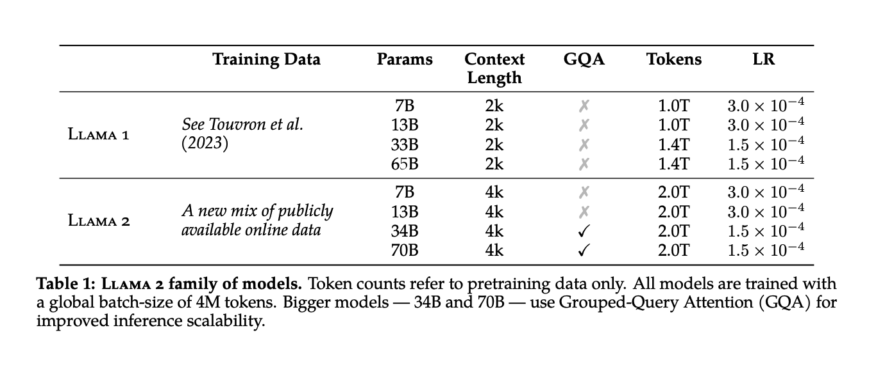
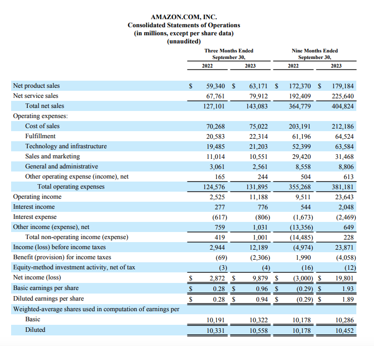

# Table Summary

This optional capability of vectara-ingest will use `unstructured` to identify tables and `OpenAI`'s GPT-4 
to summarize the table into a text segment.

The main rationale here is that this works much better in the context of RAG.

In order to get a better intuition for how this works in practice, here
a few specific examples of PDF documents and how tables extracted are described
as text summaries.

## llama2.pdf [paper](https://arxiv.org/pdf/2307.09288.pdf)

The first example we'll look at is an academic paper. 
This paper has a few tables (we randomly picked 1, 2, and 6).
Let's see how various tables are summarized:

### Table 1

The text extracted normally is:
> "Llama 1 Llama 2 Training Data See Touvron et al. (2023) A new mix of publicly available online data Params 7B 13B 33B 65B 7B 13B 34B 70B Context Length 2k 2k 2k 2k 4k 4k 4k 4k GQA ✗ ✗ ✗ ✗ ✗ ✗ ✓ ✓ Tokens 1.0T 1.0T 1.4T 1.4T 2.0T 2.0T 2.0T 2.0T LR 3.0 × 10−4 3.0 × 10−4 1.5 × 10−4 1.5 × 10−4 3.0 × 10−4 3.0 × 10−4 1.5 × 10−4 1.5 × 10−4"

The summary is:
> "The table compares two models, Llama 1 and Llama 2, across various configurations. Both models have been trained with data referenced from Touvron et al. (2023). The configurations vary by the number of parameters (7B, 13B, 33B, 65B for Llama 1 and 7B, 13B, 34B, 70B for Llama 2), context length (2k for Llama 1 and 4k for Llama 2), and the number of tokens (1.0T for the smaller Llama 1 models, 1.4T for the larger ones, and 2.0T across all Llama 2 models). The General Question Answering (GQA) feature is only enabled for the largest Llama 2 models (34B and 70B). The learning rate (LR) is consistent within each model type but differs between the smaller and larger models (3.0 × 10−4 for the smaller and 1.5 × 10−4 for the larger configurations)."

### Table 2

The text extracted normally is:
> "Time (GPU hours) Power Consumption (W) Carbon Emitted (tCO2eq) Llama 2 7B 13B 34B 70B 184320 368640 1038336 1720320 400 400 350 400 31.22 62.44 153.90 291.42 Total 3311616 539.00"

The summary is:
> "The table provides data on the environmental impact of running the Llama model with different numbers of parameters, measured in terms of time taken (GPU hours), power consumption (Watts), and carbon emissions (metric tons of CO2 equivalent). The Llama model is run with 2 billion, 7 billion, 13 billion, 34 billion, and 70 billion parameters, consuming a total of 3311616 GPU hours. The power consumption remains constant at 400W for all configurations except for the 13 billion parameter model, which consumes 350W. The total carbon emissions for all runs amount to 539.00 metric tons of CO2 equivalent, with individual runs contributing 31.22, 62.44, 153.90, and 291.42 tCO2eq respectively."

### Table 6

The text extracted normally is:
> "Dataset Num. of Comparisons Avg. # Turns per Dialogue Avg. # Tokens per Example Avg. # Tokens in Prompt Avg. # Tokens in Response Anthropic Helpful Anthropic Harmless OpenAI Summarize OpenAI WebGPT StackExchange Stanford SHP Synthetic GPT-J 122,387 43,966 176,625 13,333 1,038,480 74,882 33,139 3.0 3.0 1.0 1.0 1.0 1.0 1.0 251.5 152.5 371.1 237.2 440.2 338.3 123.3 17.7 15.7 336.0 48.3 200.1 199.5 13.0 88.4 46.4 35.1 188.9 240.2 138.8 110.3 Meta (Safety & Helpfulness) 1,418,091 3.9 798.5 31.4 234.1 Total 2,919,326 1.6 595.7 108.2 216.9"

The summary is:
> "The table provides data on various datasets used for comparisons, detailing the number of comparisons, average number of turns per dialogue, and average number of tokens per example, prompt, and response. Here's a summary:\n\n- Anthropic Helpful: 122,387 comparisons, 3.0 turns/dialogue, 251.5 tokens/example, 17.7 tokens/prompt, 88.4 tokens/response.\n- Anthropic Harmless: 43,966 comparisons, 3.0 turns/dialogue, 152.5 tokens/example, 15.7 tokens/prompt, 46.4 tokens/response.\n- OpenAI Summarize: 176,625 comparisons, 1.0 turn/dialogue, 371.1 tokens/example, 336.0 tokens/prompt, 188.9 tokens/response.\n- OpenAI WebGPT: 13,333 comparisons, 1.0 turn/dialogue, 237.2 tokens/example, 48.3 tokens/prompt, 240.2 tokens/response.\n- StackExchange: 1,038,480 comparisons, 1.0 turn/dialogue, 440.2 tokens/example, 200.1 tokens/prompt, 138.8 tokens/response.\n- Stanford SHP: 74,882 comparisons, 1.0 turn/dialogue, 338.3 tokens/example, 199.5 tokens/prompt, 110.3 tokens/response.\n- Synthetic GPT-J: 33,139 comparisons, 1.0 turn/dialogue, 123.3 tokens/example, 13.0 tokens/prompt, 35.1 tokens/response.\n- Meta (Safety & Helpfulness): 1,418,091 comparisons, 3.9 turns/dialogue, 798.5 tokens/example, 31.4 tokens/prompt, 234.1 tokens/response.\n- Total across all datasets: 2,919,326 comparisons, 1.6 turns/dialogue, 595.7 tokens/example, 108.2 tokens/prompt, 216.9 tokens/response.\n\nThe Meta (Safety & Helpfulness) dataset has the highest average number of turns per dialogue and tokens per example, while the Synthetic GPT-J dataset has the lowest average number of tokens per example, prompt, and response. The total figures provide an average across all datasets."

## [Amazon 2023 Q3 Press release](https://s2.q4cdn.com/299287126/files/doc_financials/2023/q3/AMZN-Q3-2023-Earnings-Release.pdf)

This document provides an example of a financial report, in this case from Amazon's Q3 2023 results.

### Cash Flows table

The text extracted normally is:
> "2022 2023 CASH, CASH EQUIVALENTS, AND RESTRICTED CASH, BEGINNING OF PERIOD  37,700
  50,067 OPERATING ACTIVITIES: Net income (loss) 2,872 9,879 Adjustments to reconcile net income (loss) to net cash from operating activities: Depreciation and amortization of property and equipment and capitalized content costs, operating lease assets, and other 10,327 12,131 Stock-based compensation 5,556 5,829 Non-operating expense (income), net (1,272) (990) Deferred income taxes (825) (1,196) Changes in operating assets and liabilities: Inventories 732 808 Accounts receivable, net and other (4,794) (6,718) Accounts payable (1,226) 2,820 Accrued expenses and other (20) (1,321) Unearned revenue 54 (25) Net cash provided by (used in) operating activities 11,404 21,217 INVESTING ACTIVITIES: Purchases of property and equipment (16,378) (12,479) Proceeds from property and equipment sales and incentives 1,337 1,181 Acquisitions, net of cash acquired, non-marketable investments, and other (885) (1,629) Sales and maturities of marketable securities 557 1,393 Purchases of marketable securities (239) (219) Net cash provided by (used in) investing activities (15,608) (11,753) FINANCING ACTIVITIES: Common stock repurchased — — Proceeds from short-term debt, and other 12,338 216 Repayments of short-term debt, and other (7,916) (8,095) Proceeds from long-term debt 107 — Repayments of long-term debt — — Principal repayments of finance leases (1,465) (1,005) Principal repayments of financing obligations (48) (64) Net cash provided by (used in) financing activities 3,016 (8,948) Foreign currency effect on cash, cash equivalents, and restricted cash (1,334) (502) Net increase (decrease) in cash, cash equivalents, and restricted cash (2,522) 14 CASH, CASH EQUIVALENTS, AND RESTRICTED CASH, END OF PERIOD  35,178
  50,081 SUPPLEMENTAL CASH FLOW INFORMATION: Cash paid for interest on debt, net of capitalized interest  304
  465 Cash paid for operating leases 1,813 2,692 Cash paid for interest on finance leases 88 76 Cash paid for interest on financing obligations 39 50 Cash paid for income taxes, net of refunds 742 2,628 Assets acquired under operating leases 6,755 3,345     2022202336,477
  54,253 (3,000) 19,801 29,236 34,843 14,015 17,704 13,521 (409) (4,781) (4,412) (5,772) (1,194) (13,109) (10,364) (6,907) (5,415) (7,335) (9,022) 1,711 949 17,579 42,481 (47,053) (38,141) 4,172 3,361 (7,485) (5,458) 25,918 4,059 (2,332) (1,053) (26,780) (37,232) (6,000) — 30,946 17,395 (21,757) (19,339) 12,931 — (1) (3,386) (6,301) (3,605) (186) (198) 9,632 (9,133) (1,730) (288) (1,299) (4,172) 35,178  50,081932
  1,821 6,268 7,687 290 234 152 150 4,340 6,982 14,031 11,075 2022 2023  30,177
  35,178 11,323 20,079 39,103 47,528 17,695 23,310 1,589 3,036 (8,404) (7,779) (7,687) 1,986 (19,665) (19,152) 1,082 4,437 1,998 (3,245) 2,631 1,454 39,665 71,654 (65,988) (54,733) 6,637 4,513 (7,866) (6,289) 38,455 9,742 (10,598) (1,286) (39,360) (48,053) (6,000) — 33,613 28,002 (24,416) (35,136) 13,131 8,235 (1,002) (4,643) (8,561) (5,245) (233) (260) 6,532 (9,047) (1,836) 349 5,001 14,903  35,178
  50,081  1,299
  2,450 7,961 10,052 404 318 189 205 4,674 8,677 19,839 15,844"

The summary is:
> "The table provides financial data for two consecutive years, 2022 and 2023, detailing cash flow activities for a company. Here's a summary of the key figures: **Cash and Cash Equivalents**: - Beginning of Period: Increased from  37,700𝑖𝑛2022𝑡𝑜
 50,067 in 2023. - End of Period: Decreased to  35,178𝑖𝑛2022𝑏𝑢𝑡𝑠𝑙𝑖𝑔ℎ𝑡𝑙𝑦𝑖𝑛𝑐𝑟𝑒𝑎𝑠𝑒𝑑𝑡𝑜
 50,081 in 2023. **Operating Activities**: - Net Income (Loss): Improved significantly from  2,872𝑖𝑛2022𝑡𝑜
 9,879 in 2023. - Depreciation, Amortization, and Other Adjustments: Rose from  10,327𝑖𝑛2022𝑡𝑜
 12,131 in 2023. - Stock-Based Compensation: Increased slightly from  5,556𝑖𝑛2022𝑡𝑜
 5,829 in 2023. - Net Cash from Operating Activities: More than doubled from  11,404𝑖𝑛2022𝑡𝑜
 21,217 in 2023. **Investing Activities**: - Purchases of Property and Equipment: Decreased from  16,378𝑖𝑛2022𝑡𝑜
 12,479 in 2023. - Net Cash Used in Investing Activities: Improved from a use of  15,608𝑖𝑛2022𝑡𝑜𝑎𝑢𝑠𝑒𝑜𝑓
 11,753 in 2023. **Financing Activities**: - Proceeds from Debt and Other Financing: Decreased from  12,338𝑖𝑛2022𝑡𝑜
 216 in 2023. - Repayments of Debt and Other Financing: Increased from  7,916𝑖𝑛2022𝑡𝑜
 8,095 in 2023. - Net Cash from Financing Activities: Shifted from a provision of  3,016𝑖𝑛2022𝑡𝑜𝑎𝑢𝑠𝑒𝑜𝑓
 8,948 in 2023. **Supplemental Cash Flow Information**: - Cash Paid for Interest and Operating Leases: Increased across the board from 2022 to 2023. - Assets Acquired Under Operating Leases: Decreased from  6,755𝑖𝑛2022𝑡𝑜
 3,345 in 2023. Overall, the company saw an improvement in net income and cash provided by operating activities in 2023 compared to 2022. However, there was a significant reduction in cash inflows from financing activities and a slight decrease in cash at the end of the period in 2022, which then slightly increased in 2023."

### Statement of Operations

The text extracted normally is:
> "Three Months Ended September 30, 2022 2023  59,340
  63,17167,76179,912𝑇𝑜𝑡𝑎𝑙𝑛𝑒𝑡𝑠𝑎𝑙𝑒𝑠127,101143,083𝐶𝑜𝑠𝑡𝑜𝑓𝑠𝑎𝑙𝑒𝑠70,26875,022𝐹𝑢𝑙𝑓𝑖𝑙𝑙𝑚𝑒𝑛𝑡20,58322,314𝑇𝑒𝑐ℎ𝑛𝑜𝑙𝑜𝑔𝑦𝑎𝑛𝑑𝑖𝑛𝑓𝑟𝑎𝑠𝑡𝑟𝑢𝑐𝑡𝑢𝑟𝑒19,48521,203𝑆𝑎𝑙𝑒𝑠𝑎𝑛𝑑𝑚𝑎𝑟𝑘𝑒𝑡𝑖𝑛𝑔11,01410,551𝐺𝑒𝑛𝑒𝑟𝑎𝑙𝑎𝑛𝑑𝑎𝑑𝑚𝑖𝑛𝑖𝑠𝑡𝑟𝑎𝑡𝑖𝑣𝑒3,0612,561𝑂𝑡ℎ𝑒𝑟𝑜𝑝𝑒𝑟𝑎𝑡𝑖𝑛𝑔𝑒𝑥𝑝𝑒𝑛𝑠𝑒(𝑖𝑛𝑐𝑜𝑚𝑒),𝑛𝑒𝑡165244𝑇𝑜𝑡𝑎𝑙𝑜𝑝𝑒𝑟𝑎𝑡𝑖𝑛𝑔𝑒𝑥𝑝𝑒𝑛𝑠𝑒𝑠124,576131,8952,52511,188277776(617)(806)7591,031𝑇𝑜𝑡𝑎𝑙𝑛𝑜𝑛−𝑜𝑝𝑒𝑟𝑎𝑡𝑖𝑛𝑔𝑖𝑛𝑐𝑜𝑚𝑒(𝑒𝑥𝑝𝑒𝑛𝑠𝑒)4191,0012,94412,189(69)(2,306)(3)(4)
2,872  9,879
   0.28
  0.96    0.28  0.94
  Basic 10,191 10,322 Diluted Nine Months Ended September 30, 2022 2023 172,370179,184192,409225,640364,779404,824203,191212,18661,19664,52452,39963,58429,42031,4688,5588,806504613355,268381,1819,51123,6435442,048(1,673)(13,356)649(14,485)228(4,974)23,8711,990(16)(3,000)
19,801 (0.29)  1.93(0.29)
  1.89 10,178 10,286"

The summary is:
> "For the three months ended September 30, 2023, the table shows the following financial data: - Total net sales increased from  127,101𝑡𝑜
 143,083. - Cost of sales rose from  70,268𝑡𝑜
 75,022. - Fulfillment costs went up from  20,583𝑡𝑜
 22,314. - Technology and infrastructure expenses increased from  19,485𝑡𝑜
 21,203. - Sales and marketing expenses slightly decreased from  11,014𝑡𝑜
 10,551. - General and administrative expenses dropped from  3,061𝑡𝑜
 2,561. - Other operating expenses increased from  165𝑡𝑜 244. - Total operating expenses went up from  124,576𝑡𝑜
 131,895. - Operating income grew significantly from  2,525𝑡𝑜
 11,188. - Total non-operating income (expense) improved from  419𝑡𝑜
 1,001. - Net income before taxes increased from  2,944𝑡𝑜
 12,189. - Provision for income taxes went up from  69𝑡𝑜
 2,306. - Net income after taxes saw a substantial increase from  2,872𝑡𝑜
 9,879. - Earnings per share (basic and diluted) increased from  0.28𝑡𝑜
 0.96 and  0.28𝑡𝑜
 0.94, respectively. - The number of basic shares outstanding slightly increased from 10,191 to 10,322, and diluted shares from 10,178 to 10,286. For the nine months ended September 30, 2023, the table shows: - Total net sales increased from  364,779𝑡𝑜
 404,824. - Cost of sales went up from  203,191𝑡𝑜
 212,186. - Fulfillment costs increased from  61,196𝑡𝑜
 64,524. - Technology and infrastructure expenses rose from  52,399𝑡𝑜
 63,584. - Sales and marketing expenses increased from  29,420𝑡𝑜
 31,468. - General and administrative expenses slightly increased from  8,558𝑡𝑜
 8,806. - Other operating expenses went up from  504𝑡o 613. - Total operating expenses increased from  355,268𝑡𝑜
 381,181. - Operating income improved from  9,511𝑡𝑜
 23,643. - Total non-operating income (expense) went from a positive  544𝑡𝑜𝑎𝑛𝑒𝑔𝑎𝑡𝑖𝑣𝑒
 2,048. - Net income before taxes decreased from  23,871𝑡𝑜
 1,990. - Provision for income taxes increased from a benefit of  16𝑡𝑜𝑎𝑛𝑒𝑥𝑝𝑒𝑛𝑠𝑒𝑜𝑓
 3,000. - Net income after taxes decreased significantly from  19,801𝑡𝑜𝑎𝑙𝑜𝑠𝑠𝑜𝑓
 1,009. - Earnings per share (basic and diluted) decreased from  1.93𝑡𝑜𝑎𝑙𝑜𝑠𝑠𝑜𝑓
 0.29 and from  1.89𝑡𝑜𝑎𝑙𝑜𝑠𝑠𝑜𝑓
 0.29, respectively. Overall, the company experienced an increase in sales and expenses, with a notable increase in net income for the three-month period but a decrease in net income for the nine-month period."

